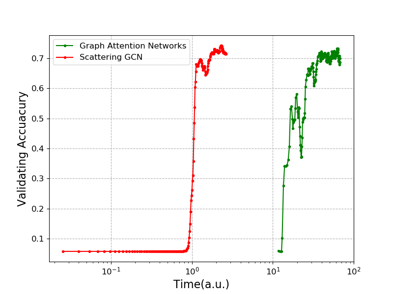

# Scattering GCN

## Reference:
*Scattering GCN: overcoming oversmoothness in graph convolutional networks*

## To run the Code
(default:Cora)\
for example run:\
python train.py --hid1 20 --hid2 20 --l1 0.005 --sct_inx1 3 --dropout 0.9 --smoo 0.1

For running other model(citeseer as example), please change the 
`med_f0=20,med_f1=20,med_f2=20`
and 
`self.gc11 = GC_withres(60+para3+para4, nclass,smooth=smoo)`
in model.py. and run:\
python train.py --dataset citeseer --l1 0.005 --sct_inx1 0 --sct_inx2 0 --dropout 0.98 --smoo 0.04 --hid1 20 --hid2 30
(med_f0=15,med_f1=15,med_f2=15)\
pubmed:(med_f0=20,med_f1=20,med_f2=20)\
python train.py --hid1 19 --hid2 22 --l1 5e-3 --sct_inx1 1 --sct_inx2 0 --dropout 0.9 --smoo 1.0 --epoch 500

## Details of the parameters
1. `hid1`: the width in channel  <-----
2. `hid2`: the width in channel  <-----
3. `weight_decay`:  <-----L2 reg 
4. `l1`:  <-----L1 reg 
5. `epochs`:  <-----Training epochs
6. `sct_inx1`:  <-----the index of first channel, the index order is listed in Tab 3,4,5.
7. `sct_inx2`:  <-----the index of second channel, the index order is listed in Tab 3,4,5.

* * Scattering term
*  * Index = 0 <-----     
*  * Index = 1 <-----   
*  * Index = 2 <-----    
*  * Index = 3 <-----  
*  * Index = 4 <-----  

8. `dropout`: The dropout setting
9. `smoo`: The graph residual convolution kernel's parameters.

Figure. Architectures Visualization. Dataset: a) Cora, b) Citeseer, c) Pubmed. The number indicated under each channel signifies the number of neurons associated with it.

## Training curve 
with different  for graph residual convolution(Cora）\

## Running time 
on Citeseer:\

## Requirement:
pytorch\
cuda\
scipy: for the sparse matrix operation 

## Misc
GCN:\
https://github.com/tkipf/pygcn \
GAT:\
https://github.com/PetarV-/GAT
