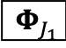
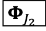
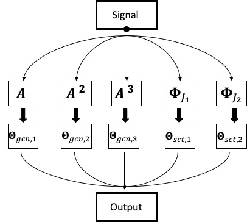

# scatteringGCN

## Reference:
**Yimeng Min, Frederik Wenkel and Guy Wolf**\
*Scattering GCN: overcoming oversmoothness in graph convolutional networks*

## To run the Code
(default:Cora)\
for example run:\
python train.py --hid1 20 --hid2 20 --l1 0.005 --epochs 200 --sct_inx1 3 --dropout 0.9 --smoo 0.1

## Details of the parameters
1. `hid1`: the width in channel  

2. `hid2`: the width in channel 
3. `weight_decay`: L2 reg
4. `l1`: L1 reg 
5. `epochs`: Training epochs
6. `sct_inx1`: the index of first channel, the index order is listed in Tab 3,4,5.
7. `sct_inx2`: the index of second channel, the index order is listed in Tab 3,4,5.
8. `dropout`: ~
9. `smoo`: The graph residual convolution kernel's parameters.

## Training curve

## requirement:
pytorch\
cuda\
scipy: for the sparse matrix operation 

