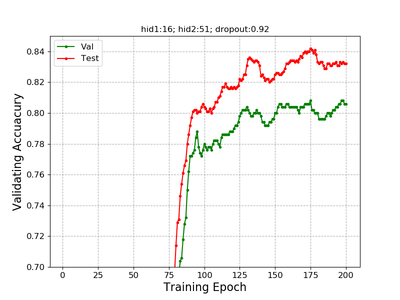

# Scattering GCN


The followup work is here: <br>
(attention-based architecture to produce adaptive node representations) <br>

https://arxiv.org/abs/2010.15010  to be appeared at ICASSP<br>
https://github.com/dms-net/Attention-based-Scattering

```
python train.py
```
```
@article{min2020scattering,
  title={Scattering GCN: Overcoming Oversmoothness in Graph Convolutional Networks},
  author={Min, Yimeng and Wenkel, Frederik and Wolf, Guy},
  journal={arXiv preprint arXiv:2003.08414},
  year={2020}
}
```
During the training, we found that we can assign different widths of channels and achieve similar performace (sometimes even seems better): 
e.g. here is the training history of hid1:16 hid2:51 dropout:0.92
```
python train.py  --hid1 16 --hid2 51  --dropout 0.92
```


Where the highest validation accuracy@Epoch=175 corresponds to a test accuracy of 84.2.
During the grid search, we search the widths of scattering channels, dropout and the smooth parameters for the graph res layer. Tuning the width of the three los-pass ones may also result in better performance. 
Some very different widths: e.g.(python train.py --hid1 5 --hid2 50 --smoo 0.6) can also have relatively good performance on Cora.
The scatteringGCN relies on handcrafted design, requiring careful selection of frequency bands.
We recommend using the scattering attention based model for learning node-wise weights for combining multiple scattering and GCN channels, though may hurt the performance.

Another thing we want to re-emphasize is that the activation value in this paper is ||^q, we don't use relu/tanh, etc.


## Requirement:
pytorch\
cuda\
scipy: for the sparse matrix operation 

## Reference
https://github.com/tkipf/pygcn  \
https://github.com/PetarV-/GAT \
https://github.com/liqimai/Efficient-SSL

